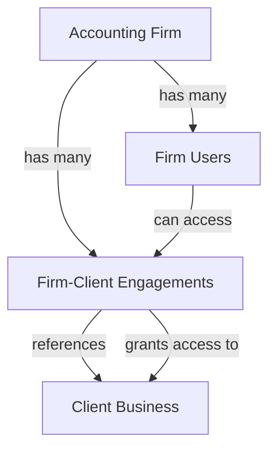
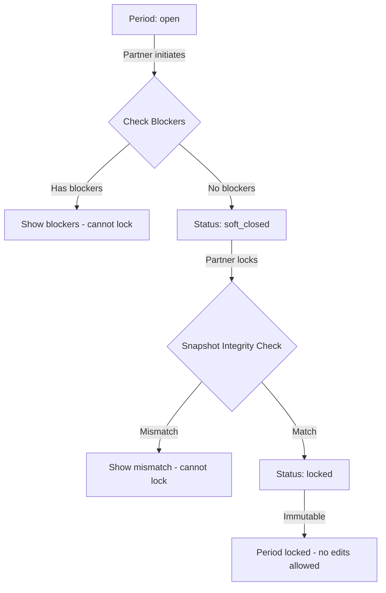

# Accountant-First Workspace: Technical Documentation

**Version:** 1.0  
**Date:** 2024  
**Author:** Technical Documentation Lead

---

## Table of Contents

1. [The Onboarding Flow (Accountant Perspective)](#1-the-onboarding-flow-accountant-perspective)
2. [Adding a New Client (The Bridge Strategy)](#2-adding-a-new-client-the-bridge-strategy)
3. [Data Imports & "Quick Post" UI](#3-data-imports--quick-post-ui)
4. [Validation & Period Locking](#4-validation--period-locking)

---

## 1. The Onboarding Flow (Accountant Perspective)

### 1.1 Signup Intent Selection

**Plain English Explanation:**
When a new user signs up for FINZA, they are presented with two options during account creation:
- **"I manage accounting for clients"** - For accounting firms and bookkeepers
- **"I run my own business"** - For business owners and operators

The selection is stored in the user's authentication metadata and determines the entire onboarding path.

**Technical Implementation:**

**File:** `app/signup/page.tsx`

```typescript
// Lines 12-13: State for signup intent
const [signupIntent, setSignupIntent] = useState<"business_owner" | "accounting_firm">("business_owner")

// Lines 26-36: Store signup intent in user metadata during signup
const { data, error: authError } = await supabase.auth.signUp({
  email,
  password,
  options: {
    emailRedirectTo: `${appUrl}/auth/callback`,
    data: {
      full_name: fullName,
      signup_intent: signupIntent, // Stored in user_metadata
    },
  },
})

// Lines 45-51: Route based on signup intent
if (signupIntent === "accounting_firm") {
  router.push("/accounting/firm/setup")
} else {
  router.push("/business-setup")
}
```

**Key Points:**
- `signup_intent` is stored in `auth.users.user_metadata.signup_intent`
- Default value: `"business_owner"`
- Accounting firm users are redirected to `/accounting/firm/setup` immediately after signup

---

### 1.2 Bypassing Business Owner Setup

**Plain English Explanation:**
When an accounting firm user logs in or completes onboarding, the system checks their signup intent. If it's `"accounting_firm"`, the system:

1. Checks if they belong to an accounting firm
2. If yes → redirects to Firm Management Dashboard (`/accounting/firm`)
3. If no → redirects to Firm Setup (`/accounting/firm/setup`)

This bypass happens in multiple entry points to ensure accountants never see the business owner onboarding flow.

**Technical Implementation:**

**File:** `app/onboarding/page.tsx` (Lines 45-64)

```typescript
// Check signup intent before redirecting
const signupIntent = user.user_metadata?.signup_intent || "business_owner"

const businessData = await getCurrentBusiness(supabase, user.id)
if (!businessData) {
  // If accounting firm user, redirect to firm setup instead
  if (signupIntent === "accounting_firm") {
    const { data: firmUsers } = await supabase
      .from("accounting_firm_users")
      .select("firm_id")
      .eq("user_id", user.id)
      .limit(1)

    if (firmUsers && firmUsers.length > 0) {
      router.push("/accounting/firm") // Redirect to firm dashboard
      return
    } else {
      router.push("/accounting/firm/setup") // Redirect to firm setup
      return
    }
  }
  
  // Default: business owner needs a business
  router.push("/business-setup")
  return
}
```

**File:** `app/dashboard/page.tsx` (Lines 96-124)

Similar logic exists in the dashboard entry point to redirect accounting firm users away from the standard business dashboard.

---

### 1.3 Database Flags Distinguishing Accountant from Business User

**Plain English Explanation:**
The system uses a multi-layered approach to distinguish accountants from business users:

1. **User Metadata:** `auth.users.user_metadata.signup_intent`
2. **Firm Membership:** `accounting_firm_users` table
3. **Engagement Access:** `firm_client_engagements` table (for client access)

**Database Schema:**

**Table: `accounting_firm_users`**
```sql
-- Migration: 104_accountant_firms_client_access.sql
CREATE TABLE accounting_firm_users (
  id UUID PRIMARY KEY,
  firm_id UUID NOT NULL REFERENCES accounting_firms(id),
  user_id UUID NOT NULL REFERENCES auth.users(id),
  role TEXT NOT NULL CHECK (role IN ('partner', 'manager', 'staff')),
  created_at TIMESTAMP WITH TIME ZONE DEFAULT NOW(),
  UNIQUE (firm_id, user_id)
);
```

**Table: `firm_client_engagements`**
```sql
-- Represents the relationship between firm and client business
CREATE TABLE firm_client_engagements (
  id UUID PRIMARY KEY,
  accounting_firm_id UUID NOT NULL REFERENCES accounting_firms(id),
  client_business_id UUID NOT NULL REFERENCES businesses(id),
  status TEXT CHECK (status IN ('pending', 'active', 'suspended', 'terminated')),
  access_level TEXT CHECK (access_level IN ('read', 'write', 'approve')),
  effective_from DATE NOT NULL,
  effective_to DATE,
  created_by UUID REFERENCES auth.users(id)
);
```

**Database Function for Access Check:**

**File:** `supabase/migrations/105_accountant_access_guard.sql`

```sql
CREATE OR REPLACE FUNCTION can_accountant_access_business(
  p_user_id UUID,
  p_business_id UUID
)
RETURNS TEXT AS $$
DECLARE
  v_access_level TEXT;
BEGIN
  -- Check if user is business owner (they have full write access)
  IF EXISTS (
    SELECT 1 FROM businesses
    WHERE id = p_business_id AND owner_id = p_user_id
  ) THEN
    RETURN 'write';
  END IF;
  
  -- Check if user is in accountant_firm_users AND firm has engagement for business
  SELECT aca.access_level INTO v_access_level
  FROM accounting_firm_users afu
  INNER JOIN firm_client_engagements aca
    ON afu.firm_id = aca.accounting_firm_id
  WHERE afu.user_id = p_user_id
    AND aca.client_business_id = p_business_id
  LIMIT 1;
  
  RETURN v_access_level; -- Returns 'read', 'write', 'approve', or NULL
END;
$$ LANGUAGE plpgsql;
```

**Key Distinguishing Flags:**

| Flag | Location | Purpose |
|------|----------|---------|
| `signup_intent` | `auth.users.user_metadata` | Initial routing decision |
| `firm_id` | `accounting_firm_users.firm_id` | Firm membership |
| `role` | `accounting_firm_users.role` | Role within firm (partner/senior/junior/readonly) |
| `access_level` | `firm_client_engagements.access_level` | Client-specific access (read/write/approve) |
| `status` | `firm_client_engagements.status` | Engagement status (pending/active/suspended/terminated) |

---

## 2. Adding a New Client (The Bridge Strategy)

### 2.1 Shell Business Creation

**Plain English Explanation:**
For clients that don't yet use FINZA, accountants can create a "shell business" - a minimal business record that allows the accountant to manage the client's books without requiring the client to sign up for FINZA themselves.

The shell business has:
- Business name
- Optional: industry (null = "books-only" mode)
- No owner_id (or a placeholder)
- No user authentication required

**Technical Implementation:**

**File:** `app/api/businesses/search/route.ts`

The search API supports a `books_only=true` parameter that filters for businesses without industry or with null industry:

```typescript
// File: app/api/businesses/search/route.ts
if (booksOnly === "true") {
  query = query.or("industry.is.null")
}
```

**File:** `app/accounting/firm/clients/add/page.tsx` (Lines 87-96)

When adding a client, the system searches existing businesses:

```typescript
const searchBusinesses = async () => {
  try {
    const response = await fetch(`/api/businesses/search?q=${encodeURIComponent(searchQuery)}&books_only=true`)
    if (response.ok) {
      const data = await response.json()
      setBusinesses(data.businesses || [])
    }
  } catch (err) {
    console.error("Error searching businesses:", err)
  }
}
```

**Shell Business Creation Flow:**

1. Accountant searches for business name
2. If not found, business can be created with:
   - `name`: Client business name
   - `industry`: `null` (indicates books-only mode)
   - `owner_id`: Can be `null` or placeholder
3. Engagement is created linking firm to business

---

### 2.2 Firm ID vs Business ID Relationship

**Plain English Explanation:**
The relationship between an accounting firm and a client business is managed through the `firm_client_engagements` table:

- **Firm ID** (`accounting_firms.id`): Represents the accounting firm
- **Business ID** (`businesses.id`): Represents the client's business
- **Engagement** (`firm_client_engagements`): Links them with access level and effective dates

This allows:
- One firm to manage multiple client businesses
- One business to potentially be managed by multiple firms (though typically one)
- Temporal access control (effective_from, effective_to)
- Access level granularity (read/write/approve)

**Database Schema:**

**File:** `supabase/migrations/104_accountant_firms_client_access.sql`

```sql
-- Firms table
CREATE TABLE accounting_firms (
  id UUID PRIMARY KEY,
  name TEXT NOT NULL,
  created_by UUID NOT NULL REFERENCES auth.users(id),
  created_at TIMESTAMP WITH TIME ZONE DEFAULT NOW()
);

-- Engagements table (the bridge)
CREATE TABLE firm_client_engagements (
  id UUID PRIMARY KEY,
  accounting_firm_id UUID NOT NULL REFERENCES accounting_firms(id),
  client_business_id UUID NOT NULL REFERENCES businesses(id),
  status TEXT NOT NULL CHECK (status IN ('pending', 'active', 'suspended', 'terminated')),
  access_level TEXT NOT NULL CHECK (access_level IN ('read', 'write', 'approve')),
  effective_from DATE NOT NULL,
  effective_to DATE,
  created_by UUID NOT NULL REFERENCES auth.users(id),
  UNIQUE (accounting_firm_id, client_business_id)
);
```

**Relationship Diagram:**



**API Implementation:**

**File:** `app/api/accounting/firm/engagements/route.ts` (Lines 122-158)

```typescript
// Create engagement
const { data: engagement, error: createError } = await supabase
  .from("firm_client_engagements")
  .insert({
    accounting_firm_id: firm_id,
    client_business_id: business_id,
    status: "pending",
    access_level,
    effective_from: effective_from,
    effective_to: effective_to || null,
    created_by: user.id,
  })
  .select()
  .single()
```

---

### 2.3 Context Switching Logic

**Plain English Explanation:**
When an accountant works with multiple clients, they need to explicitly switch context between client environments. This is managed through sessionStorage to ensure hard isolation - no data leakage between clients.

The system uses a two-level context:
1. **Firm Context:** The active accounting firm (stored in `finza_active_firm_id`)
2. **Client Context:** The active client business (stored in `finza_active_client_business_id`)

When switching firms, the client context is automatically cleared to prevent cross-firm data leakage.

**Technical Implementation:**

**File:** `lib/firmSession.ts`

```typescript
const ACTIVE_FIRM_ID_KEY = 'finza_active_firm_id'
const ACTIVE_FIRM_NAME_KEY = 'finza_active_firm_name'

export function setActiveFirmId(firmId: string | null, firmName?: string | null): void {
  if (typeof window === 'undefined') return
  
  if (firmId) {
    sessionStorage.setItem(ACTIVE_FIRM_ID_KEY, firmId)
    if (firmName) {
      sessionStorage.setItem(ACTIVE_FIRM_NAME_KEY, firmName)
    }
  } else {
    sessionStorage.removeItem(ACTIVE_FIRM_ID_KEY)
    sessionStorage.removeItem(ACTIVE_FIRM_NAME_KEY)
  }
  
  // Clear client context on firm change (hard isolation)
  const { clearActiveClient } = require('./firmClientSession')
  clearActiveClient()
  
  // Dispatch custom event to notify other components
  window.dispatchEvent(new CustomEvent('firmChanged', { detail: { firmId, firmName } }))
}
```

**File:** `lib/firmClientSession.ts`

```typescript
const ACTIVE_CLIENT_BUSINESS_ID_KEY = 'finza_active_client_business_id'
const ACTIVE_CLIENT_BUSINESS_NAME_KEY = 'finza_active_client_business_name'

export function setActiveClientBusinessId(businessId: string | null, businessName?: string | null): void {
  if (typeof window === 'undefined') return
  
  if (businessId) {
    sessionStorage.setItem(ACTIVE_CLIENT_BUSINESS_ID_KEY, businessId)
    if (businessName) {
      sessionStorage.setItem(ACTIVE_CLIENT_BUSINESS_NAME_KEY, businessName)
    }
  } else {
    sessionStorage.removeItem(ACTIVE_CLIENT_BUSINESS_ID_KEY)
    sessionStorage.removeItem(ACTIVE_CLIENT_BUSINESS_NAME_KEY)
  }
  
  // Dispatch custom event to notify other components
  window.dispatchEvent(new CustomEvent('clientChanged', { detail: { businessId, businessName } }))
}
```

**Usage in Firm Dashboard:**

**File:** `app/accounting/firm/page.tsx` (Lines 643-647)

```typescript
<button
  onClick={(e) => {
    e.stopPropagation()
    setActiveClientBusinessId(client.business_id, client.business_name)
    router.push(`/accounting?business_id=${client.business_id}`)
  }}
  className="px-4 py-2 bg-blue-600 text-white text-sm rounded-lg hover:bg-blue-700"
>
  Enter Accounting
</button>
```

**Isolation Guarantees:**

1. **Hard Isolation:** Client context is cleared when firm changes
2. **Explicit Selection:** Client must be explicitly selected via UI
3. **Event-Driven:** Components listen for `clientChanged` events to update state
4. **Session-Based:** Context persists only for the browser session (cleared on tab close)

---

## 3. Data Imports & "Quick Post" UI

### 3.1 External Ledger Mode

**Plain English Explanation:**
"External Ledger" mode is used when an accountant manages a client's books that are maintained outside of FINZA's operational system. This is the core "Accountant-First" workflow where:

- Client business may not use FINZA for daily operations
- Accountant imports historical data (opening balances, trial balances)
- Accountant posts adjustments and journal entries manually
- Business `industry` is `null` (books-only mode)

**Technical Implementation:**

The system supports "books-only" businesses via:

1. **Business with null industry:**
   ```typescript
   // File: app/api/businesses/search/route.ts
   if (booksOnly === "true") {
     query = query.or("industry.is.null")
   }
   ```

2. **Opening Balance Imports:**
   - Allows one-time import of historical balances
   - Creates journal entries with `reference_type = 'opening_balance'`

3. **Trial Balance Views:**
   - Calculates balances from ledger for any date
   - Supports external ledger reconciliation

---

### 3.2 Opening Balances Import Process

**Plain English Explanation:**
Opening balances are imported to establish the starting point for a client's books in FINZA. The process:

1. Accountant selects a period and equity offset account
2. Lines are added (account code + amount)
3. System derives debit/credit based on account type
4. Validation ensures debits = credits
5. Once approved, balances are posted to ledger as a journal entry

**Technical Implementation:**

**File:** `app/accounting/opening-balances/page.tsx` (Lines 208-216)

```typescript
const deriveDebitCredit = (accountType: string, amount: number): { debit: number; credit: number } => {
  // Asset: normal = DEBIT (positive = debit, negative = credit)
  // Liability/Equity: normal = CREDIT (positive = credit, negative = debit)
  if (accountType === "asset") {
    return amount >= 0 ? { debit: amount, credit: 0 } : { debit: 0, credit: Math.abs(amount) }
  } else {
    return amount >= 0 ? { debit: 0, credit: amount } : { debit: Math.abs(amount), credit: 0 }
  }
}
```

**File:** `app/api/accounting/opening-balances/apply/route.ts` (Lines 138-148)

```typescript
// Call the canonical apply_opening_balances RPC function
const { data: result, error: rpcError } = await supabase.rpc("apply_opening_balances", {
  p_business_id: business_id,
  p_period_start: period_start,
  p_equity_offset_account_id: equity_offset_account_id,
  p_lines: lines.map((line: any) => ({
    account_id: line.account_id,
    amount: line.amount,
  })),
  p_applied_by: user.id,
  p_note: note || null,
})
```

**Database Function:**

**File:** `supabase/migrations/096_opening_balances.sql` (Lines 46-140)

```sql
CREATE OR REPLACE FUNCTION post_opening_balance_to_ledger(
  p_business_id UUID,
  p_as_of_date DATE,
  p_lines JSONB,
  p_created_by UUID,
  p_notes TEXT DEFAULT NULL
)
RETURNS UUID AS $$
DECLARE
  journal_id UUID;
  total_debit NUMERIC := 0;
  total_credit NUMERIC := 0;
BEGIN
  -- Rule 1: Period must be open
  PERFORM assert_accounting_period_is_open(p_business_id, p_as_of_date);

  -- Rule 2: One-time rule (only one opening balance per business)
  IF EXISTS (SELECT 1 FROM accounting_opening_balances WHERE business_id = p_business_id) THEN
    RAISE EXCEPTION 'Opening balance already exists for this business.';
  END IF;

  -- Rule 3: Balancing rule
  -- Sum(debits) must equal Sum(credits)
  FOR line IN SELECT * FROM jsonb_array_elements(p_lines)
  LOOP
    total_debit := total_debit + COALESCE((line->>'debit_amount')::NUMERIC, 0);
    total_credit := total_credit + COALESCE((line->>'credit_amount')::NUMERIC, 0);
  END LOOP;

  IF ABS(total_debit - total_credit) > 0.01 THEN
    RAISE EXCEPTION 'Opening balance journal must balance.';
  END IF;

  -- Rule 4: Create journal entry
  INSERT INTO journal_entries (
    business_id,
    date,
    description,
    reference_type,
    reference_id,
    created_by
  )
  VALUES (
    p_business_id,
    p_as_of_date,
    'Opening Balance (as of ' || TO_CHAR(p_as_of_date, 'YYYY-MM-DD') || ')',
    'opening_balance',
    NULL,
    p_created_by
  )
  RETURNING id INTO journal_id;

  -- Insert journal lines
  FOR line IN SELECT * FROM jsonb_array_elements(p_lines)
  LOOP
    INSERT INTO journal_entry_lines (
      journal_entry_id,
      account_id,
      debit,
      credit,
      description
    )
    VALUES (
      journal_id,
      get_account_by_code(p_business_id, line->>'account_code'),
      COALESCE((line->>'debit_amount')::NUMERIC, 0),
      COALESCE((line->>'credit_amount')::NUMERIC, 0),
      COALESCE(line->>'description', 'Opening balance')
    );
  END LOOP;

  RETURN journal_id;
END;
$$ LANGUAGE plpgsql;
```

**Validation Rules:**

1. **One-time Rule:** Only one opening balance per business (enforced by UNIQUE constraint)
2. **Balancing Rule:** Debits must equal credits (tolerance: 0.01 for floating point)
3. **Period Rule:** Period must be open (not locked)
4. **Account Rule:** All account codes must exist

---

### 3.3 Trial Balance Import & Bulk Data Handling

**Plain English Explanation:**
Trial balances can be imported from external systems via CSV. The system:

1. Parses CSV with columns: account_code, debit, credit (or amount + account_type)
2. Validates account codes exist
3. Validates debits = credits
4. Maps to journal entry lines
5. Posts to ledger (if approved)

**CSV Mapping:**

**File:** `app/reconciliation/[accountId]/import/route.ts` (Lines 68-105)

```typescript
// Process CSV rows - simple format: date, description, amount, reference (optional)
const mappedTransactions = rows.map((row: any) => {
  const dateStr = row.date
  const description = row.description || ""
  const amount = Number(row.amount) || 0
  const ref = row.reference || null

  // Parse date
  let date: Date
  if (dateStr) {
    date = new Date(dateStr)
    if (isNaN(date.getTime())) {
      throw new Error(`Invalid date format: ${dateStr}`)
    }
  } else {
    throw new Error("Date is required for each transaction")
  }

  // Validate amount
  if (isNaN(amount) || amount === 0) {
    throw new Error(`Invalid amount: ${row.amount}`)
  }

  // Determine type based on amount sign
  // Positive = credit (money coming in), Negative = debit (money going out)
  const type = amount >= 0 ? "credit" : "debit"

  return {
    business_id: business.id,
    account_id: accountId,
    date: date.toISOString().split("T")[0],
    description: description.trim(),
    amount: Math.abs(amount),
    type,
    external_ref: ref?.trim() || null,
    status: "unreconciled",
  }
})
```

**Draft-First Model for Opening Balances:**

**File:** `supabase/migrations/150_opening_balance_imports_step9_1.sql`

The system uses a draft-approval-posting workflow:

1. **Draft:** Accountant creates import with lines (status: `'draft'`)
2. **Approval:** Partner approves (status: `'approved'`)
3. **Posting:** System posts to ledger (status: `'posted'`, creates `journal_entry_id`)

```sql
CREATE TABLE opening_balance_imports (
  id UUID PRIMARY KEY,
  accounting_firm_id UUID NOT NULL REFERENCES accounting_firms(id),
  client_business_id UUID NOT NULL REFERENCES businesses(id),
  period_id UUID NOT NULL REFERENCES accounting_periods(id),
  
  -- Status lifecycle: draft → approved → posted
  status TEXT NOT NULL CHECK (status IN ('draft', 'approved', 'posted')) DEFAULT 'draft',
  
  -- Lines stored as JSONB array: [{account_id, debit, credit, memo}]
  lines JSONB NOT NULL DEFAULT '[]'::jsonb,
  
  -- Totals (computed and validated)
  total_debit NUMERIC NOT NULL DEFAULT 0,
  total_credit NUMERIC NOT NULL DEFAULT 0,
  
  -- Ledger reference (set when posted)
  journal_entry_id UUID REFERENCES journal_entries(id),
  
  -- Constraints
  CONSTRAINT opening_balance_balance_check CHECK (
    ABS(total_debit - total_credit) < 0.01
  ),
  CONSTRAINT opening_balance_one_per_business UNIQUE (client_business_id)
);
```

**Validation Function:**

**File:** `supabase/migrations/150_opening_balance_imports_step9_1.sql` (Lines 94-160)

```sql
CREATE OR REPLACE FUNCTION validate_opening_balance_lines(p_lines JSONB)
RETURNS TABLE (
  is_valid BOOLEAN,
  total_debit NUMERIC,
  total_credit NUMERIC,
  error_message TEXT
) AS $$
DECLARE
  line_record JSONB;
  debit_sum NUMERIC := 0;
  credit_sum NUMERIC := 0;
BEGIN
  -- Check if lines is an array
  IF jsonb_typeof(p_lines) != 'array' THEN
    RETURN QUERY SELECT FALSE, 0::NUMERIC, 0::NUMERIC, 'Lines must be a JSON array'::TEXT;
    RETURN;
  END IF;

  -- Validate each line and sum totals
  FOR line_record IN SELECT * FROM jsonb_array_elements(p_lines)
  LOOP
    -- Check required fields
    IF NOT (line_record ? 'account_id') THEN
      RETURN QUERY SELECT FALSE, 0::NUMERIC, 0::NUMERIC, 'Each line must have account_id'::TEXT;
      RETURN;
    END IF;

    -- Validate debit/credit logic
    -- Each line must have either debit or credit, not both
    IF (line_record->>'debit')::NUMERIC = 0 AND (line_record->>'credit')::NUMERIC = 0 THEN
      RETURN QUERY SELECT FALSE, 0::NUMERIC, 0::NUMERIC, 'Each line must have either debit or credit'::TEXT;
      RETURN;
    END IF;

    IF (line_record->>'debit')::NUMERIC != 0 AND (line_record->>'credit')::NUMERIC != 0 THEN
      RETURN QUERY SELECT FALSE, 0::NUMERIC, 0::NUMERIC, 'Each line cannot have both debit and credit'::TEXT;
      RETURN;
    END IF;

    -- Sum totals
    debit_sum := debit_sum + COALESCE((line_record->>'debit')::NUMERIC, 0);
    credit_sum := credit_sum + COALESCE((line_record->>'credit')::NUMERIC, 0);
  END LOOP;

  -- Check balance
  IF ABS(debit_sum - credit_sum) >= 0.01 THEN
    RETURN QUERY SELECT FALSE, debit_sum, credit_sum, 
      format('Opening balance is not balanced. Debits: %s, Credits: %s', debit_sum, credit_sum)::TEXT;
    RETURN;
  END IF;

  -- Valid
  RETURN QUERY SELECT TRUE, debit_sum, credit_sum, NULL::TEXT;
END;
$$ LANGUAGE plpgsql;
```

---

## 4. Validation & Period Locking

### 4.1 Automated Integrity Checks

**Plain English Explanation:**
Before an accountant can lock a historical period, the system performs several automated integrity checks:

1. **Trial Balance Check:** Debits must equal credits
2. **Suspense Account Check:** Suspense balance must be zero
3. **Unapproved Proposals Check:** No unapproved proposals can exist
4. **Ledger Imbalance Check:** All accounts must balance
5. **Tax Line Integrity:** All tax lines must be mapped
6. **Snapshot Integrity:** Snapshot balances must match ledger-derived values

**Technical Implementation:**

**File:** `supabase/migrations/090_final_hard_constraints.sql` (Lines 24-100)

```sql
CREATE OR REPLACE FUNCTION check_blocking_conditions_before_closing(
  p_period_id UUID
)
RETURNS TABLE (
  can_close BOOLEAN,
  blockers TEXT[]
) AS $$
DECLARE
  blocker_list TEXT[] := ARRAY[]::TEXT[];
  period_record RECORD;
  suspense_account_id UUID;
  suspense_balance NUMERIC;
  unapproved_count INTEGER;
  ledger_imbalance_count INTEGER;
  unresolved_tax_count INTEGER;
BEGIN
  -- Get period details
  SELECT * INTO period_record
  FROM accounting_periods
  WHERE id = p_period_id;

  IF NOT FOUND THEN
    RETURN QUERY SELECT FALSE, ARRAY['Period not found']::TEXT[];
    RETURN;
  END IF;

  -- Check 1: Suspense balance must be zero
  SELECT id INTO suspense_account_id
  FROM chart_of_accounts
  WHERE business_id = period_record.business_id
    AND type = 'suspense'
  LIMIT 1;

  IF suspense_account_id IS NOT NULL THEN
    SELECT COALESCE(SUM(debit - credit), 0) INTO suspense_balance
    FROM journal_entry_lines
    WHERE account_id = suspense_account_id
      AND journal_entry_id IN (
        SELECT id FROM journal_entries
        WHERE business_id = period_record.business_id
          AND date >= period_record.start_date
          AND date <= period_record.end_date
      );

    IF ABS(suspense_balance) > 0.01 THEN
      blocker_list := array_append(blocker_list, format('Suspense balance is not zero: %s', suspense_balance));
    END IF;
  END IF;

  -- Check 2: No unapproved proposals
  SELECT COUNT(*) INTO unapproved_count
  FROM adjusting_journals
  WHERE business_id = period_record.business_id
    AND status = 'pending'
    AND date >= period_record.start_date
    AND date <= period_record.end_date;

  IF unapproved_count > 0 THEN
    blocker_list := array_append(blocker_list, format('Unapproved proposals exist: %s', unapproved_count));
  END IF;

  -- Check 3: Ledger imbalance (trial balance check)
  SELECT COUNT(*) INTO ledger_imbalance_count
  FROM (
    SELECT account_id, SUM(debit - credit) as balance
    FROM journal_entry_lines
    WHERE journal_entry_id IN (
      SELECT id FROM journal_entries
      WHERE business_id = period_record.business_id
        AND date >= period_record.start_date
        AND date <= period_record.end_date
    )
    GROUP BY account_id
    HAVING ABS(SUM(debit - credit)) > 0.01
  ) imbalanced_accounts;

  IF ledger_imbalance_count > 0 THEN
    blocker_list := array_append(blocker_list, format('Ledger imbalances detected: %s accounts', ledger_imbalance_count));
  END IF;

  -- Check 4: Unresolved tax lines
  SELECT COUNT(*) INTO unresolved_tax_count
  FROM journal_entry_tax_lines
  WHERE journal_entry_line_id IN (
    SELECT id FROM journal_entry_lines
    WHERE journal_entry_id IN (
      SELECT id FROM journal_entries
      WHERE business_id = period_record.business_id
        AND date >= period_record.start_date
        AND date <= period_record.end_date
    )
  )
  AND tax_account_id IS NULL;

  IF unresolved_tax_count > 0 THEN
    blocker_list := array_append(blocker_list, format('Unresolved tax lines: %s', unresolved_tax_count));
  END IF;

  -- Return result
  IF array_length(blocker_list, 1) IS NULL THEN
    RETURN QUERY SELECT TRUE, ARRAY[]::TEXT[];
  ELSE
    RETURN QUERY SELECT FALSE, blocker_list;
  END IF;
END;
$$ LANGUAGE plpgsql;
```

**Integration with Period Status Transition:**

**File:** `supabase/migrations/084_create_accounting_periods.sql` (Lines 293-300)

```sql
-- Check blocking conditions before moving to closing
IF p_new_status = 'closing' THEN
  SELECT * INTO blocker_check
  FROM check_blocking_conditions_before_closing(p_period_id);
  
  IF NOT blocker_check.can_close THEN
    RAISE EXCEPTION 'Cannot move period to closing. Blocking conditions: %', array_to_string(blocker_check.blockers, ', ');
  END IF;
END IF;
```

---

### 4.2 Period Locking Logic

**Plain English Explanation:**
Period locking is a one-way process that makes a period immutable:

1. **Status Transition:** `open` → `soft_closed` → `locked`
2. **Authority Check:** Only Partners can close/lock periods
3. **Integrity Check:** All blocking conditions must be resolved
4. **Snapshot Check:** Before locking, snapshots must match ledger
5. **No Backward Transitions:** Once locked, a period cannot be reopened

**Technical Implementation:**

**File:** `supabase/migrations/084_create_accounting_periods.sql` (Lines 89-120)

```sql
CREATE OR REPLACE FUNCTION validate_period_status_transition(
  p_old_status TEXT,
  p_new_status TEXT
)
RETURNS BOOLEAN AS $$
BEGIN
  -- Only forward transitions allowed
  IF p_old_status = 'open' AND p_new_status NOT IN ('soft_closed', 'locked') THEN
    RAISE EXCEPTION 'Invalid transition from open: %', p_new_status;
  END IF;
  
  IF p_old_status = 'soft_closed' AND p_new_status != 'locked' THEN
    RAISE EXCEPTION 'Invalid transition from soft_closed: %', p_new_status;
  END IF;
  
  IF p_old_status = 'locked' THEN
    RAISE EXCEPTION 'Cannot transition from locked status';
  END IF;
  
  RETURN TRUE;
END;
$$ LANGUAGE plpgsql;
```

**File:** `supabase/migrations/084_create_accounting_periods.sql` (Lines 270-290)

```sql
-- Check accountant authority for closing/closed/locked transitions
IF p_new_status IN ('closing', 'closed', 'locked') THEN
  is_accountant := is_user_accountant(p_user_id, period_record.business_id);
  
  IF NOT is_accountant THEN
    RAISE EXCEPTION 'Only accountants can move periods to closing, close, or lock periods. User does not have accountant role for this business.';
  END IF;
END IF;

-- Integrity Rule: Before locking, verify snapshots match ledger-derived values
IF p_new_status = 'locked' THEN
  SELECT * INTO integrity_check
  FROM verify_period_snapshot_integrity(p_period_id);
  
  IF NOT integrity_check.is_valid THEN
    RAISE EXCEPTION USING
      MESSAGE = format('Cannot lock period: Snapshot integrity check failed. Snapshots do not match ledger-derived values. Mismatches: %s. Accountant must resolve mismatch (usually mapping/suspense issue) before locking.', integrity_check.mismatches::TEXT);
  END IF;
END IF;
```

**API Implementation:**

**File:** `app/api/accounting/periods/close/route.ts` (Lines 10-465)

The API route handles period status transitions with:

1. **Validation:** Period format, action type
2. **Authority Check:** Firm role + engagement access level
3. **Blocking Check:** Calls `check_blocking_conditions_before_closing`
4. **Transition:** Updates period status via RPC function
5. **Logging:** Records activity in firm activity log

**Lock Workflow:**



**Key Constraints:**

1. **One-Way Transitions:** `open` → `soft_closed` → `locked` (no reverse)
2. **Partner Only:** Only Partners can close/lock (via `firmAuthority.ts`)
3. **Hard Blockers:** Period cannot be closed if:
   - Suspense balance ≠ 0
   - Unapproved proposals exist
   - Ledger imbalances exist
   - Tax lines unmapped
4. **Snapshot Integrity:** Before locking, snapshots must match ledger (enforced by `verify_period_snapshot_integrity`)

---

## Summary

This technical guide covers the complete "Accountant-First" workspace architecture:

1. **Onboarding:** Signup intent routes accountants to firm setup, bypassing business owner flow
2. **Client Management:** Shell businesses and engagements bridge firms to client businesses
3. **Data Imports:** Opening balances and trial balances support external ledger workflows
4. **Validation & Locking:** Automated integrity checks ensure data quality before period locking

All flows maintain hard isolation between clients, enforce role-based access control, and ensure data integrity through database-level constraints and validation functions.

---

**Related Files:**
- `app/signup/page.tsx` - Signup intent selection
- `app/accounting/firm/onboarding/page.tsx` - Firm onboarding
- `app/accounting/firm/clients/add/page.tsx` - Add client
- `lib/firmSession.ts` - Firm context management
- `lib/firmClientSession.ts` - Client context management
- `app/accounting/opening-balances/page.tsx` - Opening balance import UI
- `app/api/accounting/periods/close/route.ts` - Period locking API
